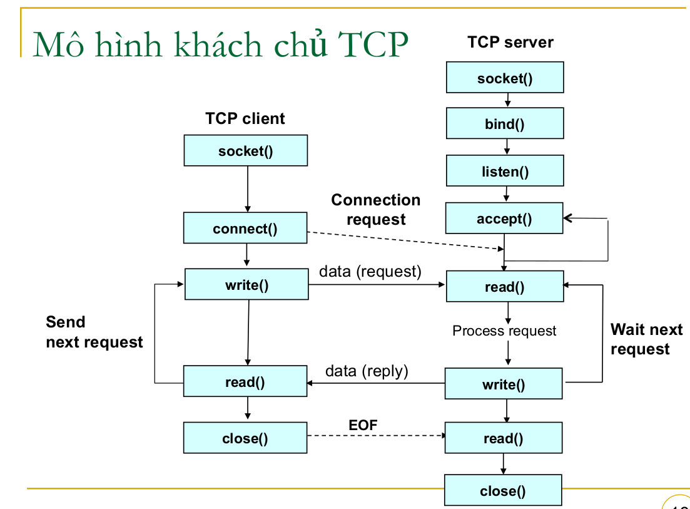

# Server configuration

1. Khai báo

```cpp

    WSADATA wsaData;
    SOCKET listeningSocket;
    struct sockaddr_in serverAddr, clientAddr;
    char buffer[1024];
    int clientAddrSize = sizeof(clientAddr);
```

- **_WSADATA wsaData;_**: Cấu trúc này chứa thông tin về cài đặt Winsock.
- **_SOCKET listeningSocket;_**: Biến này lưu trữ socket mà máy chủ sẽ sử dụng để lắng nghe kết nối từ khách hàng.
- **_struct sockaddr_in serverAddr, clientAddr;_**: Cấu trúc này dùng để xác định địa chỉ và cổng cho server và khách hàng.
- **_char buffer[1024];_**: Bộ đệm để lưu dữ liệu nhận được từ khách hàng.
- **_int clientAddrSize = sizeof(clientAddr);_**: Kích thước của cấu trúc địa chỉ khách hàng.

2. Khởi tạo

```cpp
if (WSAStartup(MAKEWORD(2, 2), &wsaData) != 0)
{
    std::cerr << "Failed to initialize Winsock." << std::endl;
    return 1;
}

```

WSAStartup(MAKEWORD(2, 2), &wsaData): Khởi tạo thư viện Winsock với phiên bản 2.2. Nếu thất bại, in thông báo lỗi và trả về 1.

3. Tạo Socket

```cpp
int socket(int domain, int type, int protocol);
```

- domain (hoặc address family): Xác định họ giao thức mạng mà socket sẽ sử dụng. Một số giá trị phổ biến là:

  - AF_INET: Sử dụng giao thức IPv4.
  - AF_INET6: Sử dụng giao thức IPv6.
  - AF_UNIX hoặc AF_LOCAL: Dùng cho giao tiếp giữa các tiến trình trên cùng một máy (local communication).
  - Phổ biến nhất khi lập trình mạng là sử dụng AF_INET (IPv4).

- type (hoặc socket type): Xác định kiểu của socket (TCP hay UDP):

  - SOCK_STREAM: Dùng cho kết nối hướng luồng (TCP), đảm bảo truyền dữ liệu chính xác và theo thứ tự.
  - SOCK_DGRAM: Dùng cho kết nối không hướng luồng (UDP), không đảm bảo dữ liệu sẽ đến và có thể không đến theo thứ tự.
  - SOCK_RAW: Dùng để thao tác trực tiếp với các gói tin mà không qua bất kỳ giao thức nào (ít khi sử dụng).

- protocol: Chỉ định giao thức cụ thể sẽ được sử dụng. Thông thường tham số này được đặt là 0 để hệ điều hành tự chọn giao thức phù hợp với domain và type. Một số giá trị thường gặp là:

  - IPPROTO_TCP: Sử dụng TCP.
  - IPPROTO_UDP: Sử dụng UDP.

```cpp
listeningSocket = socket(AF_INET, SOCK_STREAM, 0);
if (listeningSocket == INVALID_SOCKET)
{
    std::cerr << "Socket creation failed." << std::endl;
    WSACleanup();
    return 1;
}

```

socket(AF_INET, SOCK_STREAM, 0): Tạo một socket TCP sử dụng giao thức IPv4. Nếu thất bại, in thông báo lỗi, dọn dẹp và trả về 1.

4.  Thiết lập địa chỉ và cổng Server

```cpp
serverAddr.sin_family = AF_INET;
serverAddr.sin_port = htons(54000);
serverAddr.sin_addr.s_addr = INADDR_ANY;

```

- serverAddr.sin_family = AF_INET;: Chỉ định loại địa chỉ là IPv4.
- serverAddr.sin_port = htons(54000);: Chỉ định cổng mà server sẽ lắng nghe (54000). htons chuyển đổi từ định dạng máy chủ sang định dạng mạng.
- serverAddr.sin_addr.s_addr = INADDR_ANY;: Chỉ định rằng server sẽ lắng nghe trên tất cả các địa chỉ IP có sẵn trên máy.

5. Liên kết socket với địa chỉ

```cpp
int bind(int sockfd, const struct sockaddr *addr, socklen_t addrlen);
```

- sockfd: Là socket file descriptor (socket đã được tạo bằng hàm socket()).

- addr: Là con trỏ đến cấu trúc sockaddr, chứa địa chỉ và cổng mà bạn muốn gắn với socket. Trong lập trình mạng IPv4, bạn thường sử dụng cấu trúc sockaddr_in rồi ép kiểu nó về sockaddr.

- sockaddr_in là cấu trúc dành cho IPv4, nó có các thành phần chính:

```cpp
struct sockaddr_in {
    short sin_family;   // Địa chỉ họ (IPv4)
    unsigned short sin_port; // Cổng (port), sử dụng hàm htons() để chuyển sang định dạng mạng
    struct in_addr sin_addr; // Địa chỉ IP
};
```

- addrlen: Kích thước của cấu trúc sockaddr, sử dụng sizeof(struct sockaddr_in).

```cpp
if (bind(listeningSocket, (struct sockaddr *)&serverAddr, sizeof(serverAddr)) == SOCKET_ERROR)
{
    std::cerr << "Bind failed." << std::endl;
    closesocket(listeningSocket);
    WSACleanup();
    return 1;
}

```

trả về 0 nếu thành công và trả về -1 nếu thất bại
bind(...): Liên kết socket với địa chỉ và cổng đã được thiết lập. Nếu thất bại, in thông báo lỗi, đóng socket và dọn dẹp.

6.  Nghe kết nối

```cpp
int listen(int sockfd, int backlog);

```

- sockfd: Là socket file descriptor (socket đã được tạo bằng hàm socket() và liên kết với địa chỉ IP và cổng bằng bind()).

- backlog: Số lượng kết nối client có thể chờ trong hàng đợi trước khi bị từ chối. Nói cách khác, đây là số lượng kết nối tối đa mà hệ thống sẽ lưu lại trong hàng đợi trước khi từ chối các kết nối mới. Giá trị điển hình thường sử dụng là SOMAXCONN (mặc định tối đa).

```cpp
listen(listeningSocket, SOMAXCONN);
std::cout << "Waiting for client connection..." << std::endl;

```

trả về 0 nếu thành công và trả về -1 nếu thất bại
listen(...): Bắt đầu lắng nghe các kết nối đến socket. SOMAXCONN cho biết số lượng kết nối có thể chờ.

7. Chấp nhận kết nối

```cpp
int accept(int sockfd, struct sockaddr *addr, socklen_t *addrlen);

```

- sockfd: Là socket file descriptor (socket đã được tạo bằng socket(), liên kết với địa chỉ IP và cổng bằng bind(), và đang lắng nghe các kết nối bằng listen()).

- addr: Con trỏ đến cấu trúc sockaddr, nơi sẽ lưu trữ thông tin địa chỉ của client kết nối đến. Thông tin này bao gồm địa chỉ IP và cổng của client. Nếu bạn không cần thông tin địa chỉ của client, có thể truyền NULL.

- addrlen: Con trỏ đến biến socklen_t, chứa kích thước của cấu trúc sockaddr. Trước khi gọi accept(), bạn phải gán giá trị addrlen bằng kích thước của sockaddr (ví dụ, sizeof(struct sockaddr_in)), và sau khi gọi, addrlen sẽ chứa kích thước thực tế của địa chỉ client. Nếu bạn không quan tâm đến địa chỉ của client, có thể truyền NULL.

```cpp
SOCKET clientSocket = accept(listeningSocket, (struct sockaddr *)&clientAddr, &clientAddrSize);
if (clientSocket == INVALID_SOCKET)
{
    std::cerr << "Client connection failed." << std::endl;
    closesocket(listeningSocket);
    WSACleanup();
    return 1;
}

```

accept(...): Chấp nhận kết nối từ khách hàng. Nếu thành công, trả về một socket mới để giao tiếp với khách hàng. Nếu thất bại, in thông báo lỗi và dọn dẹp.

8. Nhận dữ liệu về client.

```cpp
int recv(int sockfd, void *buf, size_t len, int flags);

```

- sockfd: Là socket file descriptor (socket mà bạn muốn nhận dữ liệu từ client hoặc server, socket này phải được kết nối trước đó bằng connect() hoặc accept()).

- buf: Con trỏ đến bộ đệm nơi dữ liệu nhận được sẽ được lưu trữ. Bộ đệm này phải có đủ dung lượng để chứa dữ liệu.

- len: Kích thước tối đa (số byte) mà bạn muốn đọc vào bộ đệm buf. Thông thường bạn sẽ truyền kích thước của bộ đệm (ví dụ sizeof(buffer)).

- flags: Thông số điều khiển cách dữ liệu được nhận. Các giá trị cờ phổ biến là:

  - 0: Không có cờ đặc biệt, nhận dữ liệu bình thường.
  - MSG_PEEK: Nhìn vào dữ liệu nhưng không xóa chúng khỏi bộ đệm.
  - MSG_WAITALL: Đợi cho đến khi nhận đủ dữ liệu (nếu có thể), tức là chỉ trả về khi bộ đệm đã đầy.

trả về số byte nhận được

```cpp
while (true)
{
    int bytesReceived = recv(clientSocket, buffer, sizeof(buffer), 0);
    if (bytesReceived > 0)
    {
        buffer[bytesReceived] = '\0';
        std::cout << "Received: " << buffer << std::endl;

        // Nếu nhận được thông điệp "exit", thoát khỏi vòng lặp
        if (strcmp(buffer, "exit") == 0)
        {
            std::cout << "Server shutting down..." << std::endl;
            break;
        }
    }
}

```

- recv(...): Nhận dữ liệu từ socket khách hàng. bytesReceived lưu số byte nhận được.
- buffer[bytesReceived] = '\0';: Kết thúc chuỗi để có thể in ra.

8. Đóng kết nối

```cpp
closesocket(clientSocket);
closesocket(listeningSocket);
WSACleanup();
return 0;

```

- closesocket(...): Đóng socket khách hàng và socket lắng nghe.
- WSACleanup(): Dọn dẹp các tài nguyên Winsock đã sử dụng.
- return 0;: Kết thúc chương trình

> g++ server.cpp -o server -lws2_32
> ./server.exe

# Client configuration

1. Khai báo, Khởi tạo, Thiết Lập địa chỉ và đóng kết nối tương tự như server

2. Kết nối đến server

```cpp
int connect(int sockfd, const struct sockaddr *addr, socklen_t addrlen);

```

- sockfd: Là socket file descriptor mà bạn muốn kết nối đến server. Socket này đã được tạo trước đó bằng hàm socket().

- addr: Con trỏ đến cấu trúc sockaddr chứa địa chỉ của server mà client muốn kết nối. Thường sử dụng cấu trúc sockaddr_in cho IPv4.

- addrlen: Kích thước của cấu trúc sockaddr (ví dụ, sizeof(struct sockaddr_in)).

```cpp
if (connect(clientSocket, (struct sockaddr *)&serverAddr, sizeof(serverAddr)) == SOCKET_ERROR)
{
    std::cerr << "Connection to server failed." << std::endl;
    closesocket(clientSocket);
    WSACleanup();
    return 1;
}

```

connect(...): Kết nối đến server bằng socket. Nếu thất bại, in thông báo lỗi, đóng socket và dọn dẹp.

**Lỗi phổ biến**

ECONNREFUSED: Kết nối bị từ chối, thường là do server không hoạt động hoặc không lắng nghe trên cổng chỉ định.

ETIMEDOUT: Thời gian chờ kết nối đã hết, có thể do server không phản hồi.

ENETUNREACH: Mạng không thể truy cập được, xảy ra khi không có đường dẫn đến server (có thể do cấu hình mạng sai).

3. Gửi Dữ liệu đến Server

```cpp
int send(int sockfd, const void *buf, size_t len, int flags);

```

- sockfd: Socket file descriptor, đây là socket mà bạn muốn gửi dữ liệu qua (đã được kết nối trước đó bằng connect() đối với client hoặc accept() đối với server).

- buf: Con trỏ đến bộ nhớ chứa dữ liệu mà bạn muốn gửi. Đây có thể là một mảng byte hoặc một chuỗi ký tự (ví dụ: một chuỗi C-style char).

- len: Độ dài của dữ liệu cần gửi (tính bằng byte).

- flags: Cờ điều khiển cách gửi dữ liệu. Thông thường, bạn có thể đặt giá trị này là 0 để gửi dữ liệu một cách bình thường. Các giá trị khác như:

  - MSG_DONTWAIT: Không chờ nếu socket không sẵn sàng gửi dữ liệu (non-blocking).
  - MSG_OOB: Gửi dữ liệu ngoài băng tần (out-of-band).

```cpp
while (true)
{
    std::string message; // Sử dụng std::string để nhận thông điệp
    std::cout << "Enter message (type 'exit' to quit): ";
    std::getline(std::cin, message); // Nhận toàn bộ dòng

    // Gửi thông điệp
    send(clientSocket, message.c_str(), message.length(), 0);

    // Kiểm tra nếu người dùng muốn thoát
    if (message == "exit")
    {
        break; // Thoát vòng lặp
    }
}

```

send(clientSocket, message.c_str(), message.length(), 0);: Gửi thông điệp đến server. message.c_str() chuyển đổi std::string thành chuỗi ký tự kiểu C.

**Lỗi phổ biến**

ECONNRESET: Kết nối bị đóng từ phía đối tác, thường là do đối tác đóng socket hoặc gặp sự cố.

EWOULDBLOCK: Socket không sẵn sàng gửi dữ liệu (nếu đang ở chế độ non-blocking).

EPIPE: Kết nối đã bị phá vỡ (khi gửi dữ liệu đến một socket đã bị đóng).
